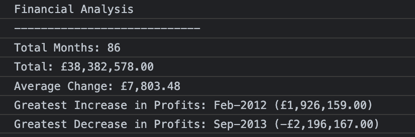

# Console Finances

## Description

Creating code for analyzing the financial records of a company.

## Installation

N/A

## Usage

[Demo URL](https://celiyo.github.io/console-finances/)

You have been given a dataset composed of arrays with two fields, Date and Profit/Losses.
Your task is to write JavaScript code that analyzes the records to calculate each of the following:

- The total number of months included in the dataset.
- The net total amount of Profit/Losses over the entire period.
- The average of the **changes** in Profit/Losses over the entire period.
  - You will need to track what the total change in profits are from month to month and then find the average.
  - (`Total/Number of months`)
- The greatest increase in profits (date and amount) over the entire period.
- The greatest decrease in losses (date and amount) over the entire period.

## Credits

N/A

## License
This project is open source and available under the [MIT License](LICENSE).
